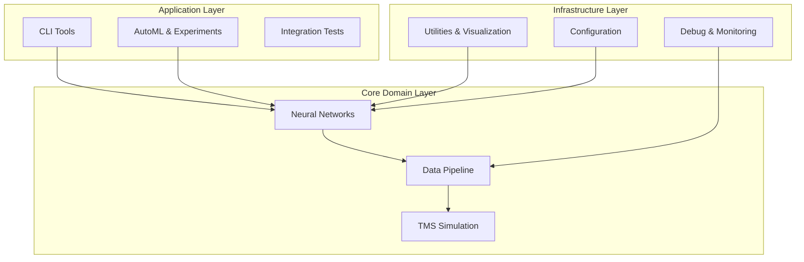
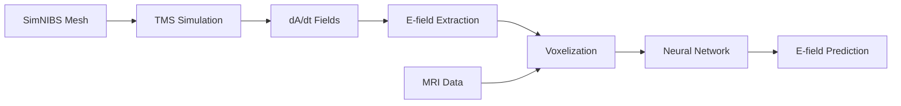

# TMS E-field Prediction: Neural Network-Based Electric Field Prediction for Transcranial Magnetic Stimulation

<div align="center">


*A comprehensive neural network framework for predicting electric field distributions in Transcranial Magnetic Stimulation (TMS) applications*

[Features](#-features) • [Installation](#-installation) • [Quick Start](#-quick-start) • [Architecture](#-architecture) • [Documentation](#-documentation) • [Contributing](#-contributing)

</div>

---

## 🎯 Overview

This project implements a state-of-the-art machine learning pipeline for predicting TMS-induced electric field distributions using neural networks. The system bridges the gap between computationally expensive electromagnetic simulations and real-time clinical applications, enabling rapid and accurate E-field predictions for personalized TMS treatment planning.

### 🔬 Key Innovation

- **Fast Prediction**: Reduces computation time from hours to seconds
- **High Accuracy**: Maintains clinical-grade precision in E-field predictions
- **Multi-Modal Input**: Combines MRI data with dA/dt field information
- **Subject Generalization**: Cross-subject model training and validation
- **Production Ready**: Comprehensive AutoML and optimization framework

---

## ✨ Features

### 🧠 **Neural Network Architectures**
- **U-Net Variants**: Specialized 3D U-Net architectures for biomedical data
- **Dual-Modal Models**: Separate processing paths for MRI and dA/dt data
- **Attention Mechanisms**: CBAM-based attention for improved feature extraction
- **Magnitude & Vector Prediction**: Support for both scalar and vector field outputs

### 🔄 **Data Pipeline**
- **SimNIBS Integration**: Seamless workflow with SimNIBS simulation environment
- **Mesh-to-Grid Transformation**: Efficient voxelization of irregular mesh data
- **Field Processing**: Advanced E-field and dA/dt data preprocessing
- **Multi-Subject Support**: Cross-subject training and validation capabilities

### 🤖 **AutoML & Optimization**
- **Bayesian Optimization**: Automated hyperparameter tuning with Ray Tune
- **CMA-ES Support**: Evolutionary optimization strategies
- **K-Fold Cross-Validation**: Robust model evaluation framework
- **Distributed Training**: Multi-GPU support for large-scale experiments

### 📊 **Visualization & Analysis**
- **3D Field Visualization**: Interactive Three.js-based field rendering
- **Performance Metrics**: Comprehensive evaluation suite for TMS-specific metrics
- **Training Monitoring**: Real-time training progress and resource monitoring
- **Model Comparison**: Side-by-side analysis of different architectures

---

## 🏗️ Architecture

The system follows a **three-tier architecture** with clear separation of concerns:



### 🔄 **Data Flow**



---

## 🚀 Installation

### Prerequisites

- Python 3.8+
- CUDA-capable GPU (recommended)
- SimNIBS 3.0+ (for simulation data)

### Setup

```bash
# Clone the repository
git clone https://github.com/yourusername/tms-efield-prediction.git
cd tms-efield-prediction

# Create virtual environment
python -m venv venv
source venv/bin/activate  # On Windows: venv\Scripts\activate

# Install dependencies
pip install -r requirements.txt

# Install in development mode
pip install -e .
```

### Docker Setup

```bash
# Build Docker image
docker build -t tms-efield-prediction .

# Run with GPU support
docker run --gpus all -v $(pwd):/workspace tms-efield-prediction
```

---

## ⚡ Quick Start

### 1. Generate Training Data

```bash
python generate_training_data_cli.py \
    --subject_id "sub-01" \
    --bin_size 64 \
    --processes 4 \
    --output_format pytorch
```

### 2. Train a Model

```python
from tms_efield_prediction.experiments import MagnitudeExperimentRunner
from tms_efield_prediction.models import SimpleUNetMagnitudeModel

# Configure experiment
config = {
    'model_type': 'unet_magnitude',
    'learning_rate': 1e-3,
    'batch_size': 8,
    'epochs': 100
}

# Run experiment
runner = MagnitudeExperimentRunner(config)
results = runner.train_and_evaluate()
```

### 3. AutoML Optimization

```bash
# Bayesian optimization
python train_automl_BO.py \
    --num_trials 50 \
    --max_epochs 100 \
    --gpus 2

# CMA-ES optimization
python train_automl_CMAES.py \
    --num_trials 30 \
    --population_size 8
```

### 4. Visualize Results

```python
from tms_efield_prediction.utils.visualization import visualize_prediction_vs_ground_truth

# Visualize model predictions
visualize_prediction_vs_ground_truth(
    prediction=pred_field,
    ground_truth=target_field,
    save_path="results/visualization.png"
)
```

---

## 📋 Key Components

### 🧠 **Model Architectures**

| Model | Description | Use Case |
|-------|-------------|----------|
| `SimpleUNetMagnitudeModel` | U-Net for magnitude prediction | Clinical applications requiring scalar fields |
| `SimpleUNetVectorModel` | U-Net for vector field prediction | Research applications requiring directional info |
| `DualModalModel` | Dual-path architecture | Multi-modal input processing |
| `SimpleDualModalModel` | Simplified dual-modal | Robust tensor dimension handling |

### 📊 **Data Pipeline Components**

- **`TMSDataLoader`**: Handles SimNIBS mesh and field data loading
- **`VoxelMapper`**: Efficient mesh-to-grid transformation
- **`FieldProcessor`**: E-field and dA/dt data processing
- **`EnhancedStackingPipeline`**: Multi-channel data preparation

### 🔧 **Training Infrastructure**

- **`ModelTrainer`**: Comprehensive training engine with callbacks
- **`AutoMLConfig`**: Hyperparameter optimization configuration
- **`KFoldSubjectSplitter`**: Subject-level cross-validation
- **`ResourceMonitor`**: GPU and memory management

---

## 📖 Usage Examples

### Training with Custom Architecture

```python
from tms_efield_prediction.models import DualModalModel
from tms_efield_prediction.training import ModelTrainer, TrainerConfig

# Define model configuration
model_config = {
    'input_channels': 4,  # MRI + dA/dt
    'output_channels': 1, # E-field magnitude
    'base_features': 32,
    'depth': 4
}

# Create model and trainer
model = DualModalModel(model_config)
trainer_config = TrainerConfig(
    epochs=100,
    learning_rate=1e-3,
    batch_size=8
)

trainer = ModelTrainer(model, trainer_config)
results = trainer.train(train_loader, val_loader)
```

### Multi-Subject Cross-Validation

```python
from tms_efield_prediction.automl.integration import KFoldAutoMLManager

# Setup K-fold cross-validation
kfold_manager = KFoldAutoMLManager(
    subjects=['sub-01', 'sub-02', 'sub-03', 'sub-04'],
    n_folds=4,
    optimization_method='bayesian'
)

# Run cross-validated optimization
results = kfold_manager.run_kfold_optimization(
    num_trials=20,
    max_epochs=50
)
```

### Advanced Visualization

```python
from tms_efield_prediction.utils.PC_visualization import visualize_point_clouds

# Create 3D visualization
visualize_point_clouds(
    points=[mesh_nodes],
    intensities=[field_magnitudes],
    colors=['field_intensity'],
    output_path='field_visualization.html',
    point_size=2.0
)
```

---

## 🔧 Configuration

### Model Configuration (`config/model_config.yaml`)

```yaml
model:
  architecture: "dual_modal"
  input_channels: 4
  output_channels: 1
  base_features: 32
  depth: 4
  use_attention: true

training:
  learning_rate: 1e-3
  batch_size: 8
  epochs: 100
  optimizer: "adam"
  scheduler: "cosine"

data:
  bin_size: 64
  augmentation: true
  normalization: "z_score"
```

### System Constants (`constants.py`)

```python
# E-field masking threshold
EFIELD_MASK_THRESHOLD = 1e-8

# Default voxel resolution
DEFAULT_VOXEL_SIZE = 1.0  # mm

# GPU memory management
GPU_MEMORY_THRESHOLD = 0.8
```

---

## 📊 Performance Metrics

The system provides comprehensive evaluation metrics tailored for TMS applications:

- **Magnitude Error**: Mean absolute/relative error in field magnitudes
- **Angular Error**: Directional accuracy for vector predictions
- **Hotspot Accuracy**: Clinical relevance of high-intensity regions
- **Field Similarity**: Combined magnitude and directional metrics
- **Correlation Coefficients**: Statistical similarity measures

---

## 🛠️ Development

### Running Tests

```bash
# Run all tests
python -m pytest tests/

# Run specific test categories
python -m pytest tests/test_models/
python -m pytest tests/test_pipeline/
python -m pytest tests/integration/
```

### Code Quality

```bash
# Format code
black tms_efield_prediction/

# Lint code
flake8 tms_efield_prediction/

# Type checking
mypy tms_efield_prediction/
```

### Debugging

The system includes comprehensive debugging infrastructure:

```python
from tms_efield_prediction.debug import PipelineDebugHook

# Enable debugging
debug_hook = PipelineDebugHook(sample_rate=0.1)
context.debug_hook = debug_hook

# Debug information is automatically collected
```

---

## 📚 Documentation

- **[System Architecture](docs/architecture.md)**: Detailed technical architecture
- **[API Reference](docs/api/)**: Complete API documentation
- **[User Guide](docs/user_guide.md)**: Step-by-step usage instructions
- **[Development Guide](docs/development.md)**: Contributing and development setup
- **[Research Paper](docs/thesis.pdf)**: Academic foundation and validation

---

## 🤝 Contributing

We welcome contributions! Please see our [Contributing Guide](CONTRIBUTING.md) for details.

### Development Setup

1. Fork the repository
2. Create a feature branch: `git checkout -b feature-name`
3. Make your changes and add tests
4. Run the test suite: `pytest`
5. Submit a pull request

### Areas for Contribution

- 🧠 New neural network architectures
- 📊 Additional evaluation metrics
- 🔧 Performance optimizations
- 📖 Documentation improvements
- 🐛 Bug fixes and testing

---

## 📄 License

This project is licensed under the MIT License - see the [LICENSE](LICENSE) file for details.

---

## 🙏 Acknowledgments

- **SimNIBS Team**: For the excellent electromagnetic simulation framework
- **PyTorch Community**: For the deep learning infrastructure
- **Ray Team**: For distributed computing and hyperparameter optimization
- **Research Contributors**: For validation and clinical insights

---

<div align="center">

**⭐ Star this repository if you found it helpful!**

Made with ❤️ for the TMS research community

</div>
